# monorepo-survey

A sandbox for surveying monorepo migration strategies. It simulates a company
with ~20 independent repos (`sample-repos/`) that share code through a private
npm registry, so tooling can be evaluated against realistic multi-repo pain:
mixed build/test toolchains, internal `@acme/*` dependencies, and version skew.

## What we want from a monorepo tool

- **Build cache** — a task's output is cached by its inputs and replayed instead
  of re-executed, locally and (with a remote cache) across machines and CI.
- **Internal dependency** — workspace-linked `@acme/*` packages: changing a lib
  is immediately visible to its consumers, without publishing to the npm
  registry (the publish/install/unpublish loop this sandbox goes through is
  exactly what this removes).
- **Action dependency** — task ordering derived from the dependency graph
  (build `@acme/logger` before `@acme/http-client` before `shop-web`), instead
  of the hand-maintained topological list in `scripts/publish-all.mjs`.
- **Dependency graph introspection** — query and visualize the package graph
  (`nx graph`, `turbo query`, `pnpm why`), instead of the hand-drawn diagram below.

## Evaluation questions

Beyond the feature list, judge each candidate on these — scored by doing, not
by reading docs:

- **Is it easy to maintain?** How much per-package config does it need across
  our 20 repos, and does it drift? What does onboarding repo #21 take? Who has
  to understand the tool when a toolchain (vite/webpack/parcel/...) is upgraded —
  each team, or one platform owner?
- **Is it easy to reason about?** Can a newcomer predict what
  `build shop-web` will run, in what order, and why? When the cache misses (or
  wrongly hits), can we find out why — is there a "explain this cache key"
  story? Do error messages point at the real repo, or at tool internals?
- **Is it easy to integrate into our CI flow?** Does it fit our existing CI
  provider, or assume its own SaaS? Can the remote cache be self-hosted (like
  our Verdaccio here), and what are the security implications of sharing it?
  Does affected-detection work with shallow clones and merge queues?

## Comparison

(snapshot 2026-08 — re-verify versions and licensing before committing, Nx has
changed policy here more than once. pnpm workspaces is the no-tool baseline.)

|                          | pnpm workspaces (baseline) | Turborepo                               | Nx                                              | Moon                          |
| ------------------------ | -------------------------- | --------------------------------------- | ----------------------------------------------- | ----------------------------- |
| Version                  | 11.x                       | 2.x (2.10)                              | 23.x                                            | 2.x (2.5)                     |
| Weekly downloads         | ~177.6M (npm `pnpm`)       | ~23.5M (npm `turbo`)                    | ~10.6M (npm `nx`)                               | ~400K (npm `@moonrepo/cli` ~266K + GitHub releases/proto ~130K) |
| 2026 trend (npm downloads/month, Jan 2026 vs Jul 2026) | 📈 +227% (Jan 183M → Jul 598M) | 📈 +168% (Jan 31M → Jul 83M) | ➡️ +26% (Jan 33M → Jul 42M) | 📈 +331% (Jan ~335K → Jul ~1.4M; npm + GitHub releases, GitHub side estimated from cumulative per-release counts; volatile small base) |
| Remote cache             | ❌ no build cache at all   | ✅ Vercel Remote Cache (open HTTP API)  | ✅ Nx Cloud                                     | ✅ Bazel Remote Execution API |
| Self-hosted remote cache | —                          | ✅ free (e.g. `turborepo-remote-cache`) | ⚠️ paid (Powerpack plugins or Nx Cloud on-prem) | ✅ free (e.g. `bazel-remote`) |
| Non-JS tasks (Go/Python CLI & e2e) | ⚠️ scripts run anything, graph is npm-only | ⚠️ wrapper `package.json` required (graph is npm-only) | ✅ plain `run-commands` targets + declared inputs | ✅ native toolchains (pinned via proto) |
| Internal dependency | ✅ this *is* the linking layer (`workspace:*`) the others build on | ✅ workspace links; JIT "internal packages" (consume source) or `turbo watch` (consume dist) | ✅ workspace links; source-native via tsconfig/project references, buildable libs opt-in | ✅ workspace links; auto-syncs `package.json` deps & tsconfig references from its graph |
| Action dependency | ⚠️ `pnpm -r` runs topologically + `--filter ...[ref]`, but no task pipeline (no cross-task `dependsOn`) | ✅ `dependsOn` in one root `turbo.json`; tasks = npm scripts (names must align) | ✅ per-project targets + plugin-inferred tasks (less config, more magic) | ✅ first-class tasks with explicit inputs/outputs; inherited by project type/tag |
| Graph introspection | ⚠️ package graph only (`pnpm why`, `pnpm ls -r`) | ✅ `--dry-run` / `--graph` (resolved task graph as text/file) | ✅ `nx graph` (interactive UI, best-in-class) | ✅ `moon task-graph` / `moon query` (dump/serve the graph) |

Security note: whoever can _write_ to a shared remote cache can execute code on
every machine that restores from it — restrict write tokens to CI.

Internal-dependency note: all three delegate the actual linking to package
manager workspaces — pin internal edges with `workspace:*` (fails loudly
instead of silently falling back to the registry). That protocol is
pnpm/yarn/bun only, **not npm**, so the migration implies a package manager
choice too.

## Layout

- `sample-repos/` — 20 standalone repos: 5 apps, 4 UI libs, 2 type libs,
  4 util libs, 3 CLI tools, 2 integration-test-only suites. Each has its own
  toolchain (vite / next / webpack / parcel / rollup / tsup / esbuild / babel /
  tsc / none) and test runner (vitest / jest / mocha / node:test / playwright /
  none). Every repo has a `.npmrc` pointing the `@acme` scope at the local registry.
- `registry/` — a [Verdaccio](https://verdaccio.org) private registry.
  `@acme/*` packages are stored locally and never proxied; everything else
  proxies through to npmjs.
- `scripts/publish-all.mjs` — publishes all 13 publishable `@acme/*` packages
  to the registry, including seeded historical versions.

## Internal dependency graph

Solid edges are `dependencies`, dashed edges are `devDependencies`, and ⚠ marks
a consumer pinned to an old major (deliberate skew). `@acme/repo-lint` and
`@acme/codegen-cli` are standalone — no internal dependencies in either direction.

```mermaid
flowchart TD
  subgraph apps["Apps"]
    shop_web["shop-web"]
    admin_dashboard["admin-dashboard"]
    order_service["order-service"]
    warehouse_viewer["warehouse-viewer"]
    picker_kiosk["picker-kiosk"]
  end

  subgraph tests["Integration tests"]
    e2e_checkout["e2e-checkout"]
    api_contract_tests["api-contract-tests"]
  end

  subgraph clis["CLI tools"]
    deploy_cli["@acme/deploy-cli"]
  end

  subgraph ui["UI libs"]
    ui_components["@acme/ui-components"]
    charts["@acme/charts"]
    design_tokens["@acme/design-tokens"]
    icons["@acme/icons"]
  end

  subgraph types["Type libs"]
    schema_definitions["@acme/schema-definitions"]
    api_types["@acme/api-types"]
  end

  subgraph utils["Util libs"]
    http_client["@acme/http-client"]
    logger["@acme/logger"]
    date_utils["@acme/date-utils"]
    validation_helpers["@acme/validation-helpers"]
  end

  shop_web -- "^5.2.0" --> ui_components
  shop_web -- "^2.3.0" --> http_client
  shop_web -- "^4.1.1" --> date_utils
  shop_web -. "dev ^7.0.0" .-> api_types

  admin_dashboard -- "⚠ ^4.9.0" --> ui_components
  admin_dashboard -- "^1.8.0" --> charts
  admin_dashboard -- "^2.1.0" --> http_client
  admin_dashboard -. "dev ^7.0.0" .-> api_types

  order_service -- "^1.2.0" --> schema_definitions
  order_service -- "^1.0.6" --> logger
  order_service -- "^0.12.0" --> validation_helpers
  order_service -. "dev ^7.0.0" .-> api_types

  warehouse_viewer -- "⚠ ^1.9.0" --> http_client
  warehouse_viewer -. "⚠ dev ^6.5.0" .-> api_types

  picker_kiosk -- "^0.4.0" --> icons
  picker_kiosk -- "^2.3.0" --> http_client

  e2e_checkout -. "dev ^7.0.0" .-> api_types
  api_contract_tests -. "dev ^1.2.0" .-> schema_definitions

  deploy_cli -- "^1.0.0" --> logger

  ui_components -- "^2.1.0" --> design_tokens
  ui_components -- "^0.4.0" --> icons
  charts -- "^2.0.0" --> design_tokens
  http_client -- "^1.0.0" --> logger
  schema_definitions -- "^7.0.0" --> api_types
```



## Workflow

### 1. Start the registry

```sh
cd registry
npm install   # first time only
npm start     # serves http://localhost:4873 (web UI at the same URL)
```

### 2. Publish the internal packages

```sh
node scripts/publish-all.mjs           # quick: publish source as-is (--ignore-scripts)
node scripts/publish-all.mjs --build   # full: npm install + run lifecycle builds first
```

Quick mode skips builds, so published tarballs contain source but no `dist/`
— enough for dependency-resolution and workflow experiments. Full mode runs
`npm install` + `npm run build --if-present` in each package (in topological
order, so internal deps resolve from packages published earlier in the same
run) and publishes real, runnable artifacts. Every publishable package has a
`files` field (`dist`/`lib`/`bin`), which is what keeps build output in the
tarball even though `.gitignore` excludes it — npm falls back to `.gitignore`
for tarball contents only when there is no `files` field. Re-runs are
idempotent (already-published versions are skipped); to switch a version from
source-only to built artifacts, `npm unpublish <pkg> --force --registry
http://localhost:4873/` it first (or reset the registry).

Seeded version history (so old-major consumers resolve):

| package             | versions in registry |
| ------------------- | -------------------- |
| @acme/http-client   | 1.9.5, 2.1.4, 2.3.0  |
| @acme/ui-components | 4.9.3, 5.2.0         |
| @acme/api-types     | 6.5.2, 7.0.0         |
| @acme/design-tokens | 2.0.2, 2.1.0         |
| all others          | current version only |

### 3. Install in a consumer repo

```sh
cd sample-repos/order-service
npm install    # @acme/* from Verdaccio, everything else proxied from npmjs
```

Deliberate version skew to exercise migration tooling:
`warehouse-viewer` pins `@acme/http-client@^1.9.0` and `@acme/api-types@^6.5.0`
(old majors), `admin-dashboard` pins `@acme/ui-components@^4.9.0`.

### Verify everything builds

```sh
node scripts/build-all.mjs   # npm install + npm run build in all 20 repos (registry must be running)
```

Repos without a build script (codegen-cli, e2e-checkout, api-contract-tests)
are install-only.

### Toy build cache (local + remote, from scratch)

To understand what monorepo tools actually do, this repo includes a ~200-line
implementation of the whole caching stack:

- `scripts/cached-run.mjs` — cached `npm run build` across all repos. The cache
  key hashes each repo's source files, its build command, the node version, and
  — crucially — the cache keys of its internal `@acme/*` dependencies,
  recursively. Task ordering (topological sort derived from package.json, not
  hand-maintained) and affected detection both fall out of that key design.
- `cache-server/server.mjs` — the remote cache: a dumb content-addressed blob
  store over HTTP (`GET`/`PUT /v1/artifacts/<key>`), open reads, token-gated
  writes. All intelligence lives in the client's key computation.

```sh
node cache-server/server.mjs        # start the remote cache on :4874 (optional)
node scripts/cached-run.mjs         # local -> remote -> execute (+ upload on miss)
node scripts/cached-run.mjs --no-remote
```

Measured scenarios (this machine):

| scenario                   | result                                                           |
| -------------------------- | ---------------------------------------------------------------- |
| cold run                   | 17 executed — ~18s                                               |
| warm local                 | 17 local hits — 0.1s                                             |
| local wiped, remote warm   | 17 remote hits — 0.2s                                            |
| edit `@acme/logger` source | 8 executed (logger + transitive dependents), 9 local hits — ~13s |
| revert the edit            | 17 local hits again (keys are pure functions of content)         |

Known toy limitations (the things real tools solve): inputs are "all files in
the repo minus a hardcoded ignore list" (undeclared-input bugs are on you),
outputs are a hardcoded map, builds still consume registry-installed `@acme/*`
packages rather than workspace-linked source, artifacts are not signed, and
there is no cache eviction.

### Env vars and cache keys (be aware!)

An environment variable that changes a build's output is a **cache input**, and
must be part of the cache key — otherwise the cache returns wrong hits: stale
artifacts that look fresh, the worst failure mode a cache has.

This repo contains a live example of the bug. `logger/build.mjs` minifies only
when `NODE_ENV=production`, but `scripts/cached-run.mjs` does not hash
`NODE_ENV`, so:

```sh
node scripts/cached-run.mjs                        # caches the unminified dev build
NODE_ENV=production node scripts/cached-run.mjs    # "HIT" — wrongly restores the dev artifact
```

No tool can hash the whole environment (PATH, PWD, session vars differ on every
machine — nothing would ever hit), so every tool makes env inputs **declared,
opt-in state**. How the two main candidates handle it:

- **Turborepo** — declare per task in `turbo.json`
  (`"build": {"env": ["API_URL", "NEXT_PUBLIC_*"]}`, plus `globalEnv`); the
  declared vars' values are hashed into the key. `passThroughEnv` is the
  explicit opposite: visible at runtime, excluded from the key (deploy tokens).
  **Strict env mode (default since 2.0)** runs tasks with a filtered
  environment containing only declared vars — an undeclared var isn't a silent
  wrong hit, it's a loud build failure. Framework inference auto-hashes
  bundle-inlined vars (`NEXT_PUBLIC_*`, `VITE_*`) — the ones people forget.
  Inspect with `turbo run build --dry=json`.
- **Nx** — declare as target inputs: `{"env": "API_URL"}` alongside file globs
  (and `{"runtime": "node --version"}` to hash a command's output, e.g. the
  toolchain version). No strict mode: tasks see the full parent environment, so
  an undeclared env input stays a silent risk — discipline is on you. Nx
  auto-loads `.env` files into the task environment, but loading ≠ hashing:
  values only affect the key if declared (or if the `.env` file itself falls
  under the project's file inputs).
- **`.env` files** in both tools are file inputs, not env inputs — and
  gitignored `.env` files are typically _outside_ the default file inputs, so
  they affect nothing until explicitly declared.

Survey takeaway: when trialing a tool, deliberately leave one env var
undeclared and see what happens — the difference between "wrong cache hit"
(silent) and "undefined variable, build fails" (strict mode) is the difference
between a debugging afternoon and a one-line config fix.

### Local-link alternative (no registry)

To mimic `npm link` style development instead of publish/install:

```sh
cd sample-repos/logger && npm link
cd ../http-client && npm link @acme/logger
```

### Reset

```sh
cd registry && npm run reset   # wipe registry storage (rm -rf storage)
```

Then republish with `node scripts/publish-all.mjs`.
